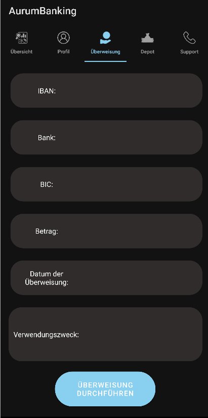
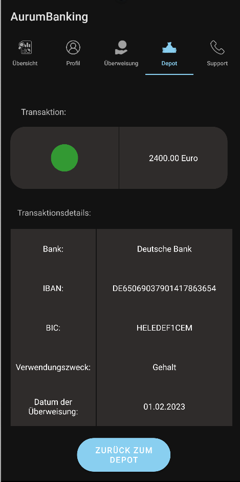

 

  
   
  <h3 align="center">PME Project WS_2022/23 - AurumBanking</h3>

Table of Contents

<ol>
  <li><a href="#note-of-thanks"> Note of thanks</a></li>
  <li><a href="#introduction"> Introduction</a></li>
  <li><a href="#app-guidance"> App Guidance</a></li>
  <li><a href="#business-diagram">Business Diagram</a></li>
  <li><a href="#entity-relationship-model">Entity Relationship Model</a></li>
  <li><a href="#app-backend-architecture">App Backend Architecture</a></li>
  <li><a href="#contributors">Contributors</a></li>
  <li><a href="#contributing">Contributing</a></li>
  <li><a href="#license">License</a></li>
</ol>

Note of thanks

# Note of thanks

I want to give a special thanks to Prof. Dr. Steffen Avemarg for the lecture, project consulting, help and the opportunity to try this project my own!

(<a href="#top">back to top</a>)

Introduction

# Introduction

This repository is the PME Project of an banking-app. Focus on UI and specification from the predefined "Programmierung mobiler Endgeräte (PME)" Module.

The App was programmed and tested on a **Google Pixel 6 Pro API 27**. 
User Credentials to access the app is:  
* Email: t@t.de 
* Password: 123

The App has **only two view** with a completed implementation of a landscape mode:
* **Money Transfer/Überweisung**
* **Support**

For this Project the programming language Kotlin and Java was used. Besides that a relational database was implemented in a local database by using LiteSQL and Room from Android Jetpack. 

(<a href="#top">back to top</a>)

App Guidance

1. Login 
To Login into the App use the following credentials.

* Email: t@t.de 
* Password: 123

The user will be generated after every restart of the app, because the project is base on a local database in the RAM.

2. Overview/Übersicht

After the Login, the user will be forwarded to the Overview-Fragment. Which will be shown in the following image. 

The lastest transaction value will show the newest transaction that's was made.

3. Profile/Profil

The user can see their personal information the tab "Profil". If the user want to change his/her password. The person has to change the switch to "yes", so the password-change section will be shown.  

4. Money Transfer/Überweisung

In the view "Überweisung" the user can execute a money transfer order. The person has to fill all the Edittext of the formula and click the "Überweisung durchführen"- Button. 

In this view the user can use the landscape mode by rotate the app with rotation function of the smartphone.

5. Deposit/Depot

In this view the user can check the current money value of her/his depot, search certain terms by click on the magnifying glass of the search bar and commit a search term. The user can also see all his transactions of the past in an recyclerview.

6. Transaction Details/Transaktionsdetails

In this view the user can see the transaction detail by clicking on the value site of the textfield from the recyclerview. The app will guide the user to the detail view. This will be shown in the following images.

By clicking on the "Zurück zum Depot"-button of the smartphone. The user can get back to the deposit view.

7. Support

In the fragement "Support" the user can send the support a spefic request. The user has to fill all the Edittext and select one of the options in "Art der Anfrage". By pressing the button "Anfrage Absenden" the message will be "sent" to the support.

This view can be used in a landscape-mode, too.

The user can use "back" button of the smartphone to return from the current tab to the tab before (example by using the "back" button: Deposit -> Überweisung -> Profil -> Login).

If the user click on "back" button of the smartphone while the user is on the login fragment, the app will be close.

(<a href="#top">back to top</a>)

Business Diagram

# Business Diagram

At the beginning of the project I tried to evaluate the business usecase of the app. Basically the app has only one view and this is from the customer as you can see on the image below. The customer/user should be able to search assignments/orders, looking in his/her deposit, transaction history and details. Therefore the customers should be able to see their personal details and changing the password to login into the app. Besides that the user can write a message to the support in a formula fragment.

(<a href="#top">back to top</a>)

Entity Relationship Model

# Entity Relationship Model

In the following image is the ER-Model the database. Only for faster and simpler SQL-Queries the transactionlist table and customer table are 1 to 1 connect. In real project this kind of ER-Model is not recommended.

(<a href="#top">back to top</a>)

App Backend Architecture 

# App Backend Architecture 

Basically the AurumBanking Backend Architecture is structured in _**8 specifics layers**_, which can be _**abstacted to 4 layers**_.

The 8 Layers you can see on the diagamm below. 

The _**abstacted to 4 layers**_ are:

* Activity/Fragement-Layer
* Viewmodel-Layer
* Repository-Layer
* DAO-Layer
* Database-Layer

The **Activity/Fragement-Layer** are the "User Interface"-Layer, in which the user can interact with the app. In this layer the data will be only process and displayed into the specific form of the UI.

The **Viemmodel-Layer** bypass the data into the **Activity/Fragment-Layer** from underlying data layer and process certain data for the overlying layers.

The **Repository-Layer** is an abstraction layer between the **Viewmodel-Layer** and the **DAO-Layers**. This layer process the function and data from both overlying and underlying layer.

The **DAO-Layer** is used for the definition of the SQL-queries and function, which will be transformed into LiteSQL. The input and output data will be operated by the CRUD-Methods.

The **Database-Layer** is the stored data layer.

(<a href="#top">back to top</a>)

Contributors

# Contributors

This repository is maintained by Tran Anh Hoang as a Project of the University Module "Programmierung mobiler Endgeräte (PME)".

(<a href="#top">back to top</a>)

Contributing

# Contributing

This repository was created for educational purposes only so no contributions are required.

(<a href="#top">back to top</a>)

License

# License

Distributed under the MIT License, see the [LICENSE](./LICENSE) file for more information.

(<a href="#top">back to top</a>)

